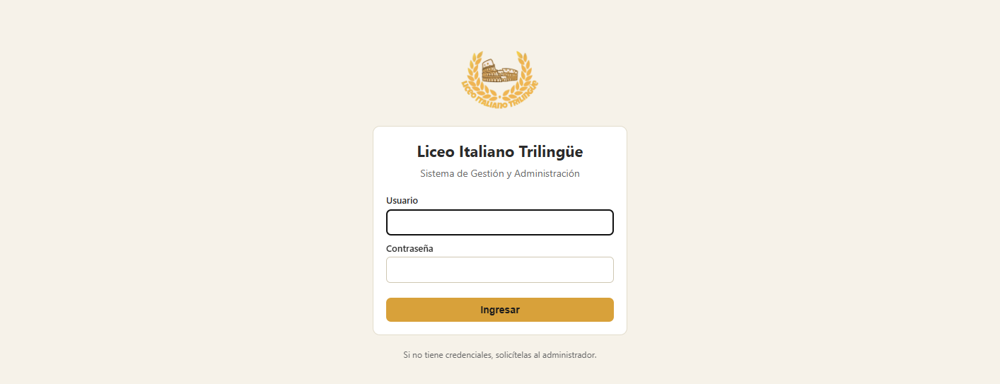
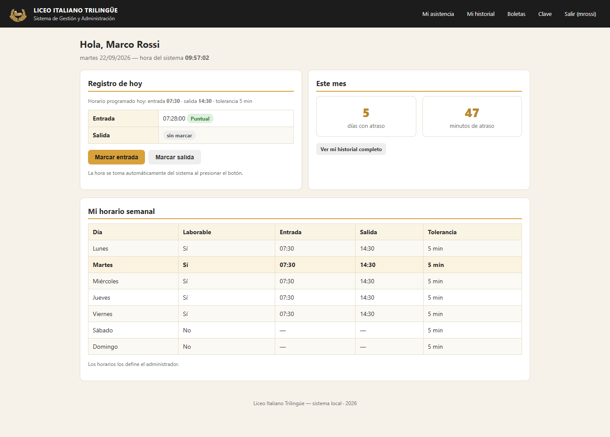
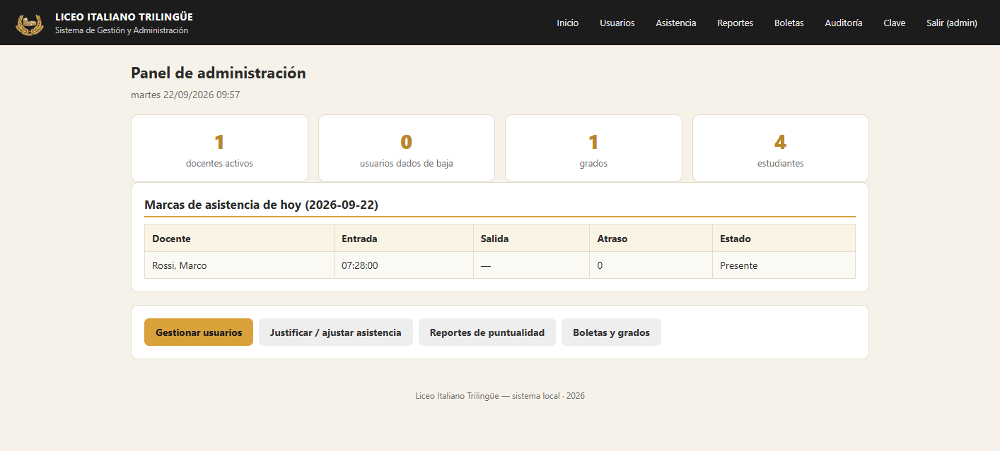
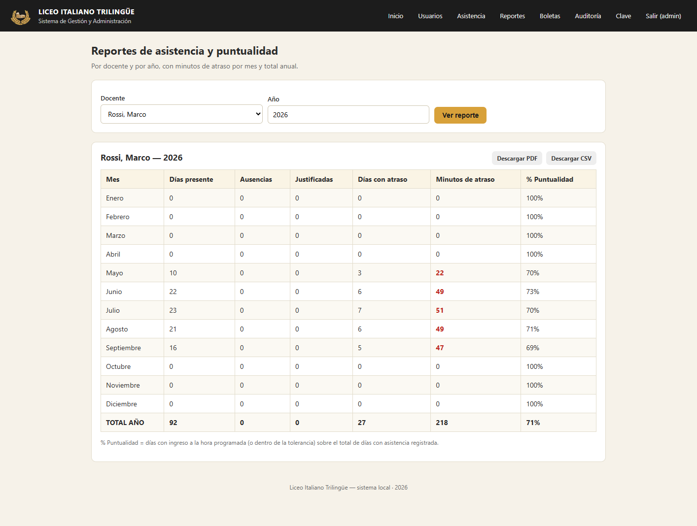
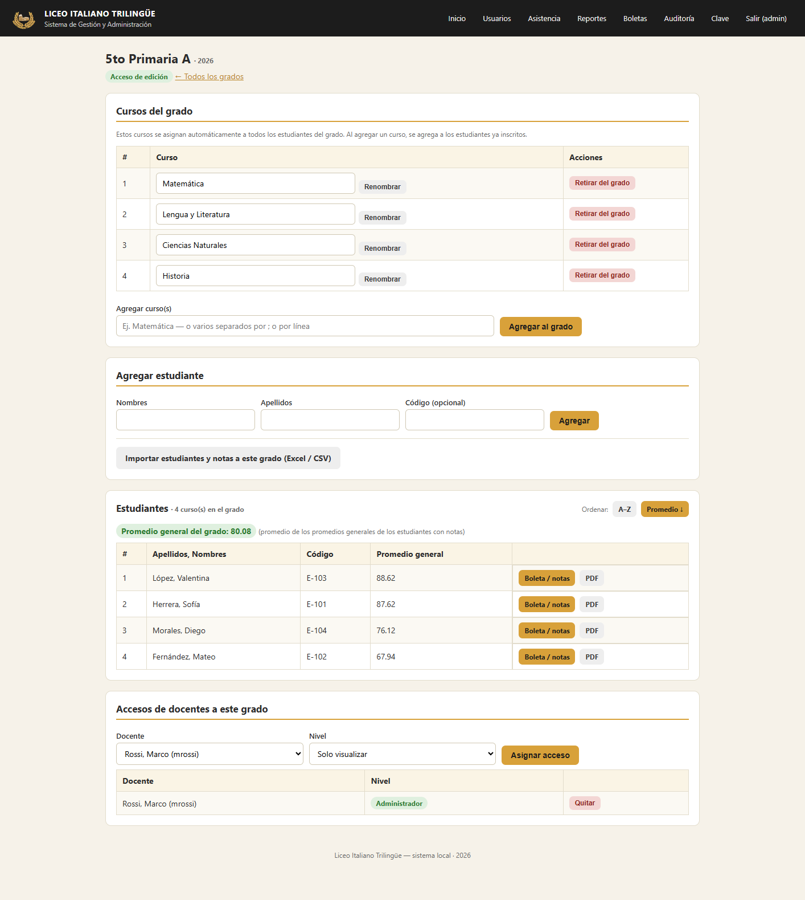
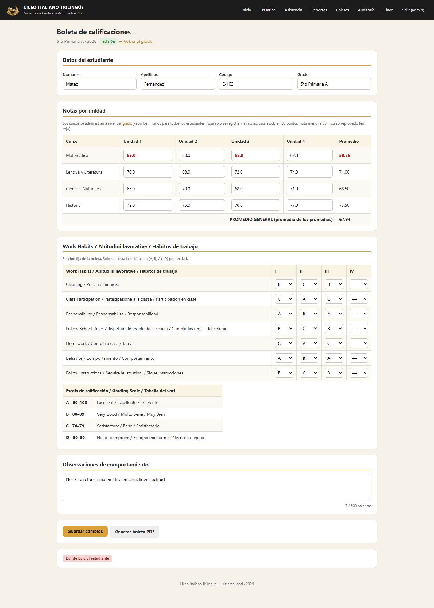
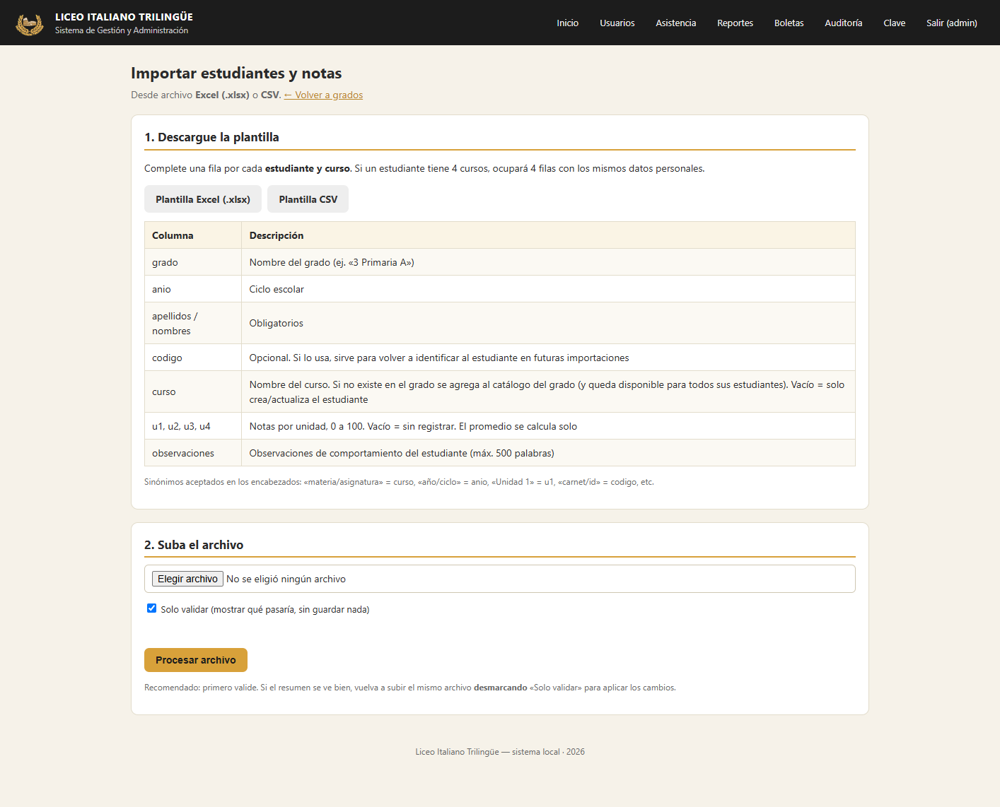
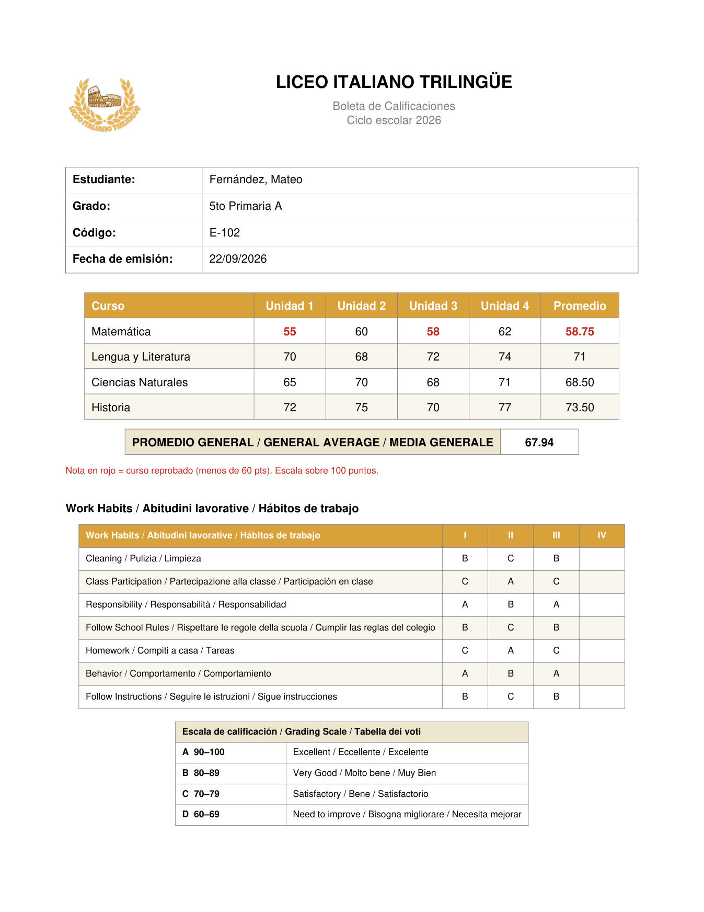

# Sistema de Gestión y Administración — Liceo Italiano Trilingüe


Sistema de gestión escolar hecho a medida, **100 % local** (sin internet ni
servicios en la nube): control de asistencia y puntualidad del personal
docente, y control de notas con generación de boletas en PDF. Corre desde el
navegador y se empaqueta como **ejecutable de Windows (`.exe`)**, con una base
de datos SQLite portátil.

Proyecto full-stack propio (backend, frontend, base de datos, generación de
documentos y empaquetado de escritorio), desarrollado de punta a punta
—modelo de datos, lógica de negocio, interfaz y seguridad— para un caso de
uso real de un colegio.

---

## 1. Qué resuelve

| Módulo | Resumen |
|---|---|
| **Asistencia docente** | Marca de entrada/salida con hora del sistema, horario semanal configurable por día y por docente, cálculo automático de minutos de atraso. |
| **Administración** | Alta/baja lógica de usuarios, justificación de inasistencias con observaciones, reportes de puntualidad por docente y por año (PDF/CSV), bitácora de auditoría. |
| **Boletas de calificaciones** | Cursos por grado (compartidos por todos sus estudiantes), notas por unidad sobre 100 puntos, promedio general del estudiante y del grado, ranking, sección fija de hábitos de trabajo (A–D) y boleta en PDF. |
| **Carga masiva** | Importación de estudiantes y notas existentes desde Excel/CSV, con validación previa y sin duplicar datos. |
| **Seguridad de sesión** | Control de acceso por rol en el servidor (no por URL), cierre de sesión al cerrar la pestaña y por inactividad. |
| **Despliegue** | Un solo `.exe` portátil; funciona en una computadora o en varias, dentro de la red local del colegio. |

## 2. Aspectos técnicos destacados

- **Backend en Flask** con control de acceso por rol a nivel de servidor
  (verificado en cada ruta, no confiado al cliente) y permisos granulares por
  grado (administrador / solo lectura).
- **Modelo relacional en SQLite** diseñado para reflejar la regla de negocio
  real (los cursos pertenecen al grado, no al estudiante), con **migración
  automática de esquema** al abrir una base creada con una versión anterior.
- **Borrado lógico** en toda la aplicación: ningún dato de asistencia, nota o
  usuario se elimina físicamente.
- **Generación de PDF** (boletas y reportes) con `reportlab`, con formato
  condicional (notas reprobatorias en rojo) y logo institucional optimizado
  en tiempo de ejecución.
- **Importador de Excel/CSV** con normalización de texto (tolerante a
  acentos/mayúsculas), modo de solo-validación (*dry run*) y resumen de
  cambios antes de aplicar.
- **Sesión endurecida**: cierre por inactividad con aviso al cliente, cierre
  al cerrar la pestaña (vía `sessionStorage`), cookies `HttpOnly` +
  `SameSite`.
- **Empaquetado a ejecutable** con PyInstaller (`--onefile`), con datos de
  usuario separados del binario para que el sistema sea transportable.
- Cobertura de pruebas manuales de extremo a extremo (asistencia, sesiones,
  boletas, importación, migración de datos) antes de cada entrega.

## 3. Capturas de pantalla

_Datos de ejemplo ficticios, generados solo para estas capturas (ver sección 4)._

<table>
<tr>
<td width="50%">

**Ingreso**


</td>
<td width="50%">

**Panel del docente — marca de asistencia**


</td>
</tr>
<tr>
<td width="50%">

**Panel de administración**


</td>
<td width="50%">

**Reporte de asistencia y puntualidad**


</td>
</tr>
<tr>
<td width="50%">

**Grado: cursos, estudiantes y promedio**


</td>
<td width="50%">

**Boleta de un estudiante (edición)**


</td>
</tr>
<tr>
<td width="50%">

**Importación masiva desde Excel/CSV**


</td>
<td width="50%">

**Boleta generada en PDF**


</td>
</tr>
</table>

## 4. Privacidad y datos de ejemplo

Este repositorio contiene **solo el código fuente**. Por diseño, `.gitignore`
excluye todo lo que se genera al usar el sistema:

- `datos/` (o `dist/datos/`): base de datos SQLite, boletas y reportes en
  PDF, clave de sesión y configuración de red — se crean solos la primera vez
  que se ejecuta el programa, y **pueden contener datos reales de personas**.
- `static/img/logo*`: el logo real del colegio no se publica por defecto
  (ver `static/img/LEER_logo.txt`); si querés incluirlo, quitá esas líneas
  del `.gitignore`.
- `build/`, `dist/`, `*.spec`: artefactos de PyInstaller, se regeneran con
  `build_exe.bat`.

Las capturas de pantalla de la sección 3 se generaron con **datos ficticios**
(docente, grado y estudiantes inventados para la demostración) sobre una base
de datos aparte, que no se publica. El logo aparece en las capturas porque es
parte de la interfaz real, aunque el archivo `logo.png` en sí no se sube al
repositorio (ver punto anterior).

El usuario administrador que trae el sistema de fábrica es `admin` /
`admin123` — **cambiar la contraseña es el primer paso** al ponerlo en uso
(ver sección 6).

---

## 5. Puesta en marcha rápida (modo desarrollo)

1. Instalar [Python 3.9+](https://www.python.org/downloads/) marcando *"Add Python to PATH"*.
2. Colocar el logo del colegio en `static/img/logo.png` (ver `static/img/LEER_logo.txt`).
3. Doble clic en **`run_dev.bat`**.
4. Se abre el navegador. Ingresar con:
   - **Usuario:** `admin`
   - **Contraseña:** `admin123`
5. Cambiar la contraseña del administrador (menú *Clave*).

## 6. Generar el ejecutable `.exe`

1. Doble clic en **`build_exe.bat`**.
2. Al terminar, el ejecutable queda en `dist\LiceoItalianoTrilingue.exe`.
3. Para instalarlo en otra PC: copiar ese `.exe` a una carpeta. Al abrirlo por
   primera vez crea la carpeta `datos/` a su lado.
4. Para **mover los datos**: copiar también la carpeta `datos/` junto al `.exe`.

> Copia de seguridad = copiar la carpeta `datos/` (contiene `liceo.db`, las
> boletas PDF y los reportes).

## 7. Poner el sistema en uso (varias computadoras)

1. Elegí **una PC como servidor** (que quede encendida en horario escolar). Copiá
   ahí `LiceoItalianoTrilingue.exe`.
2. Abrilo. Se crea `datos/configuracion.ini` con `modo = red`.
3. Windows pedirá permiso de **Firewall** la primera vez → **Permitir acceso**.
4. La ventana negra muestra una línea como
   `Desde otras computadoras: http://192.168.0.16:5000/`. Esa es la dirección que
   los docentes escriben en el navegador de su PC.
5. Pedí al encargado de red que le fije una **IP fija** a esa PC (para que la
   dirección no cambie). Opcional: crear un acceso directo en «Inicio» de Windows
   para que el sistema arranque solo.
6. Puesta a punto inicial (como `admin`): cambiar la contraseña, crear los
   usuarios de los docentes y sus horarios, crear grados y cursos.
7. Respaldo: definí quién copia la carpeta `datos/` y cada cuánto.

---

## 8. Funcionalidades

### Control de asistencia del personal docente
- Cada docente inicia sesión con usuario y contraseña **creados por el administrador**.
- Botones **Marcar entrada** / **Marcar salida**: se registra la **hora del sistema**.
- El atraso se calcula contra el **horario programado para ese día de la semana**
  (con tolerancia en minutos configurable).
- El docente ve su historial y el total de **minutos de atraso por mes y año**.

### Interfaz de administrador
- **Usuarios:** crear, editar, restablecer contraseña, activar/desactivar la
  *función de boletas*.
- **Baja lógica:** el usuario dado de baja no puede ingresar, pero **sus datos se
  conservan** (asistencias, notas, auditoría). Se puede reactivar.
- **Horarios semanales por docente:** un horario distinto por cada día
  (Lunes–Domingo): laborable o no, hora de entrada, hora de salida y tolerancia.
- **Justificación / ajuste de asistencia:** cambiar estado (presente, justificado,
  permiso, ausente), horas y minutos de atraso de cualquier día, con una
  **observación de hasta 500 palabras**. Queda registrado quién y cuándo lo modificó.
- **Reportes de asistencia y puntualidad por docente y por año:** tabla mensual
  con días presente, ausencias, justificadas, días con atraso, **minutos de
  atraso por mes**, **total anual** y **% de puntualidad**. Exportable a **PDF** y **CSV**.
- **Auditoría:** bitácora de los últimos 500 movimientos.

### Control de notas / boletas de calificaciones
- El administrador activa la *función de boletas* a un docente.
- **Los cursos son del GRADO**, no del estudiante: dentro del grado se define el
  listado de cursos (ej. Matemática, Lengua, Ciencias…). Al inscribir un estudiante
  al grado se le asignan **automáticamente todos esos cursos**; si luego se agrega
  un curso al grado, se agrega también a los estudiantes ya inscritos.
- En la boleta de cada estudiante solo se **cargan las notas por unidad**
  (los nombres de los cursos no se editan ahí, se administran en el grado).
- Estructura: **Grados → (Cursos del grado) + Estudiantes → Notas por unidad (U1–U4) + Promedio**.
- Notas **sobre 100 puntos**. Nota **menor a 60 se muestra en rojo** (curso reprobado),
  tanto en pantalla como en el PDF.
- Retirar un curso del grado es un borrado lógico: **las notas ya registradas se conservan**.
- **Promedio general** por estudiante = promedio de los promedios de sus cursos.
  En la pantalla del grado se muestra el **promedio general del grado** (promedio de
  los promedios generales) y se puede **ordenar la lista por promedio (mayor a menor)**.
- **Sección fija "Work Habits / Abitudini lavorative / Hábitos de trabajo"**: 7 renglones
  fijos (Limpieza, Participación en clase, Responsabilidad, Cumplir las reglas del colegio,
  Tareas, Comportamiento, Sigue instrucciones), calificados con **letra A/B/C/D por unidad**
  (I–IV). Los renglones y su escala (A 90–100 … D 60–69) no cambian; solo se ajusta la letra.
- **Boleta en PDF** con: nombres y apellidos del estudiante, grado, cursos, nota por
  unidad, promedio por curso, **promedio general**, la **tabla de hábitos de trabajo**
  con su **escala de calificación**, y las **observaciones de comportamiento**.
- **Accesos por grado:** el administrador puede dar a otro docente acceso a un grado
  como **Administrador** (editar notas) o **Solo visualizar** (verificar / imprimir).
- El administrador siempre puede ver y editar todos los cuadros de notas.

### Importación masiva desde Excel / CSV
Para cargar estudiantes y notas que ya existen: **Boletas → Importar desde Excel / CSV**
(o el botón *Importar a este grado* dentro de un grado).

1. Descargar la **plantilla** (`.xlsx` o `.csv`).
2. Completar **una fila por estudiante y curso** (columnas: `grado, anio, apellidos,
   nombres, codigo, curso, u1, u2, u3, u4, observaciones`). Los encabezados aceptan
   sinónimos («materia» = curso, «Unidad 1» = u1, «carnet» = codigo, «año» = anio…).
3. Subir el archivo con **«Solo validar»** marcado → muestra qué se crearía/actualizaría
   y lista las filas con problemas, **sin guardar nada**.
4. Si el resumen está bien, subir de nuevo **desmarcando** «Solo validar» para aplicar.

La importación carga las notas académicas por curso. La sección fija de hábitos de
trabajo (A/B/C/D) se llena en la boleta de cada estudiante, no por archivo.

Reglas: las notas van de 0 a 100; una nota vacía o no numérica se deja sin registrar
(se avisa). Los estudiantes se identifican por `codigo` (si se usa) o por apellidos +
nombres dentro del grado, así que **reimportar actualiza** en vez de duplicar. Los
grados que no existan se crean; **los cursos del archivo que no existan en el grado se
agregan a su catálogo** y quedan para todos los estudiantes del grado. La comparación
de nombres de grado, estudiante y curso ignora mayúsculas y acentos. Un docente solo
puede importar a grados donde tiene acceso de edición.

---

## 9. Estructura del proyecto

```
app.py              Aplicación Flask y todas las rutas
db.py               Esquema SQLite, rutas de datos, utilidades, sección fija de comportamiento
pdf_boleta.py       Generación de la boleta en PDF
pdf_reporte.py      Generación del reporte de asistencia en PDF
importador.py       Lectura y carga masiva desde Excel (.xlsx) / CSV
logo.py             Versión reducida y cacheada del logo (para PDF y web)
templates/          Vistas HTML (Jinja2)
static/             CSS y logo
datos/              (se crea solo, no se versiona) base de datos + PDFs generados
requirements.txt    Dependencias
run_dev.bat         Ejecutar en desarrollo
build_exe.bat       Construir el .exe
```

## 10. Seguridad y sesiones

- **Acceso por URL:** todas las páginas se controlan en el servidor según el rol.
  Si un docente escribe `http://127.0.0.1:5000/admin` (o cualquier `/admin/...`)
  recibe **Error 403 – Sin permisos**; nunca ve datos de administración. Lo mismo
  con las boletas: un docente solo entra a los grados que el administrador le
  asignó. Cambiar la dirección en la barra del navegador no da acceso a nada.
- **Cierre de sesión al cerrar la pestaña:** al cerrar la pestaña (o el navegador)
  la sesión queda invalidada. Si se vuelve a abrir, pide usuario y contraseña.
- **Cierre por inactividad:** tras **5 minutos sin actividad** (mouse o teclado)
  la sesión se cierra automáticamente y regresa a la pantalla de ingreso.
  Mientras haya actividad, la sesión se mantiene abierta.
  *(El valor se cambia en `app.py`, constante `INACTIVIDAD_MAX`.)*
- La cookie de sesión es `HttpOnly` + `SameSite=Lax` y no es persistente.
- El sistema está pensado para **una sesión a la vez por computadora**. Si se
  abre una segunda pestaña hacia el sistema, por seguridad se cierra la sesión.

## 11. Notas técnicas
- Base de datos: `datos/liceo.db` (SQLite). Todas las bajas son **lógicas**
  (`activo = 0`), nunca se borran filas.
- Modelo de notas: `cursos_grado` (catálogo por grado) + `notas`
  (un registro por estudiante y curso del grado). Si abre una base creada con una
  versión anterior (cursos por estudiante), el sistema **migra automáticamente** al
  iniciar y conserva la tabla previa como `cursos_legacy`.
- La contraseña se guarda con hash (PBKDF2, `werkzeug.security`).
- **Modo de red (varias computadoras):** se controla desde el archivo
  `datos/configuracion.ini` (se crea solo en el primer arranque):
  - `modo = local` → solo la computadora servidor.
  - `modo = red` → los demás equipos de la red local del colegio pueden entrar
    (opción por defecto).
  Al iniciar, la ventana negra muestra la dirección para los demás equipos, del
  estilo `http://192.168.0.16:5000/`. Esa IP la deben escribir los docentes en su
  navegador. Conviene fijar una **IP fija** a la PC servidor en el router.
  La **primera vez** que se abre en modo red, Windows pregunta por el Firewall:
  hay que pulsar **"Permitir acceso"** (redes privadas).

## 12. Licencia

Proyecto desarrollado como trabajo a medida. Agregá aquí la licencia que
corresponda si vas a publicar el repositorio (por ejemplo, uso educativo o
`MIT` si el código se puede reutilizar libremente).

## 13. Autor

Desarrollado por **[Tu nombre]** como proyecto de portafolio / evidencia de
trabajo.
<!-- Contacto: agregá aquí tu LinkedIn, correo o sitio si querés que quede visible en el repositorio. -->
=======
# SistemaDeGestionDocentes
Sistema de gestión administrativa para colegios, permite control de asistencias y control de notas de estudiantes. 
>>>>>>> d7577aa4531fd2e8bc82e14c7012e775f88f9fd2
